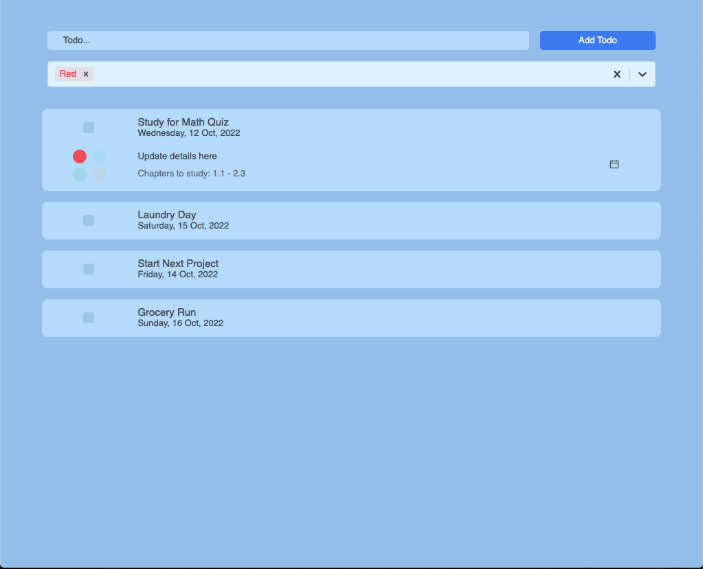

# Todo-App  
A simple Todo List Web App.

Check out the Todo List [here](https://ralphalexander.github.io/Todo-App/).
# Features: 
- **Update Todos:** Add Todos using the textfield and remove Todos by clicking on the checkbox located on the left of each todo
- **Tags and Filter:** comes in 4 different tags which are easily sortable using the filter dropdown 
- **Details:** Set details of each todo in the collapsible menu
- **Date:** Set the due date of each todo in the collapsible menu
